# c-learnings

## Computer science

Bit = byte digit - pattern with 0 and 1

* 1 bit = 0
* 2 bit = 00
* 4 bit = 0000
* 8 bit = 00000000
* 16-bit, 32-bit, 64-bit, 128-bit, 256-bit, 512-bit, 1024-bit, etc.

## Fundamentals of programming

* [ ] Abstract
* [ ] Algorithm
* [ ] Pseudocode
* [ ] Functions
  * [ ] Arguments
  * [ ] Return values
  * [ ] Side effects
* [ ] Conditionals
* [ ] Boolean expressions
* [ ] Loops
* [ ] Variables

---

Input → | Algorithm | → Output

Source Code → | Compiler | → Machine Code

Key →         |             |

Plaintext → | Cipher | → Ciphertext

Correctness, Design, and Style

---

**What is a Controller?** It is used to manage or direct the flow of data between 2 entities
model-view-controller (MVC) pattern - a common way of designing user interfaces, handling input and updating the view based on model

**What is a Converter?** It is used to change the format or type of data from one to other forms. Like a function convert data type string to integer or double

**What is a Schema?** It represents or describes the structure or organization of data
database schema - define tables, columns, indexes, constraints, and relationships. It can visualize as a diagram.

XML schema - define elements, attributes, types, and structure. XML Schema Definition (XSD) or Document Type Definition (DTD) can be used to write the schema.

The schema in artificial intelligence

The schema in data science

The schema in web development

---

## Terminal | command-line

* `ls` - list/read all the files of the current folder/directory
* `mv` - rename and move a file. example: mv hello hello.c → rename hello to hello.c
* `cd` - change directory
* `pwd` - present working directory
* `cp` - copy a file.
  * to copy a file to another file: cp `<source>` `<destination>`
  * to copy a folder to another folder: cp -r `<source directory>` `<new directory>`
* `mkdir` - to make a directory. makedir `<directory>`
* `rm` - remove a file, or directory
  * to remove a file with confirmation: rm `<file>`
  * to remove a file without confirmation: rm -f `<file>`
  * to remove a folder and its files with confirmation: rm -r `<directory>`
  * to remove a folder and its files without confirmation: rm -rf `<directory>`
* `rmdir` - remove a directory
* `chmod`
* `ln`
* `touch`
* `man`
* `diff`
* `sudo`
* `telnet`

---

## Algorithm

running time - performance → how many steps will take us to the result? | **************time OR space**************

**********Big O - worse case - upper bound**********

O(n^2) selection sort/bubble sort

O(n log n) merge sort

O(n) linear search

O(log n) binary search

O(1)

**********Omega - best case - lower bound**********

Ω(n^2) selection sort

Ω(n log n) merge sort

Ω(n) bubble sort

Ω(log n)

Ω(1) linear search/binary search

**********Theta**********

θ(n^2) selection sort

θ(n log n) merge sort

θ(n)

θ(log n)

θ(1)

---

## Memory

[cs50.ly/art](http://cs50.ly/art)

hex code: #0000FF = Red 000 Green 000 Blue 255

hexadecimal (base-16): 0 1 2 3 4 5 6 7 8 9 Aa Bb Cc Dd Ee Ff

00 = 0 / FF = 255

in memory, it understands hexadecimal as 0x0, 0xF, 0x10,…

| Decimal | Binary | Hexadecimal |
| ------- | ------ | ----------- |
| 0       | 0000   | 0x0         |
| 1       | 0001   | 0x1         |
| 2       | 0010   | 0x2         |
| 3       | 0011   | 0x3         |
| 4       | 0100   | 0x4         |
| 5       | 0101   | 0x5         |
| 6       | 0110   | 0x6         |
| 7       | 0111   | 0x7         |
| 8       | 1000   | 0x8         |
| 9       | 1001   | 0x9         |
| 10      | 1010   | 0xa         |
| 11      | 1011   | 0xb         |
| 12      | 1100   | 0xc         |
| 13      | 1101   | 0xd         |
| 14      | 1110   | 0xe         |
| 15      | 1111   | 0xf         |

### Code structure reading

| machine code (text)                                                                      |
| ---------------------------------------------------------------------------------------- |
| globals                                                                                  |
| initialized data                                                                         |
| uninitialized data                                                                       |
| heap overflow<br />[down]<br /><br />buffer overflow<br /><br />[up]<br />stack overflow |
| environment variables                                                                    |

This is how the version is created: [https://semver.org/](https://semver.org/)

## C Programming

Below is the standard structure of any C programming.

```c
#include <cs50.h> // input functions
#include <ctype.h> // check string length
#include <stdio.h> // printf function, and others
#include <stdlib.h> // malloc, free, memory functions
#include <string.h> // string related functions

int main(void)
{
}
// Turn above to below
int main(int argc, string argv[])
{
}
```

`const` is used to define a variable, and it cannot be changed. To avoid mistakenly changing the variable value later.

### Data Types & Variables

#### Data types

`void` → not a data type

`bool` → to store true or false, 1 byte of memory (8 bits) → #include <cs50.h>

*Text*

`char` → to store single characters, 1 byte of memory (8 bits), thanks to ASCII

`%c` → to print variable char value

`string` → to store a series of characters, words, sentences, paragraphs, and the like → #include <cs50.h>

`%s` → to print variable string value

```c
#include <cs50.h>
#include <stdio.h>
// Example
init main(void)
{
	string first = get_string("What's your first name? ");
	string last = get_string("What's your last name? ");
	printf("Hello, %s %s\\n", first, last);
}
```

*Number*

`float` → to store real numbers or decimal numbers, 4 bytes of memory (32 bits)

`double` → same as float, but 8 bytes of memory (64 bits)

`%f` → to print variable float or double value

`%.nf` → where n is the number of digits you want to show after 0.

`int` → to store integer value, 4 bytes of memory (32 bits)

`%i` → to print variable integer value

`%d` → to print variable integer value with decimal

`long` → same as int, but 8 bytes of memory (64 bits)

`%li` → to print variable long value

Using `long` for big numbers and `int` for small numbers.

#### Variables

```c
int a = 9; // a is integer variable
string b = "this is a string"; // b is string variable, put in double quote
char c = 'a'; // c is char variable, put in single quote
float numb1, numb2, numb3; // numb1, numb2, numb3 are all float variables

int number; // declaration
number = 17; // assignment

int number = 11; // initialization

printf("This is 100%%"); // %% defines as percentage in C
```

********Variable scope********

To define which functions that variable may be accessed.

* *Local variables:* can only be accessed within the functions
* *Global variables:* can be accessed by any functions in the program

### Operators

(+) add | subtract (-) | multiply (*) | (/) divide | mod to get remainder (%)

```c
x = x * 5;
// as same as
x *= 5;
```

To increase a number by 1, we have 2 ways:

`x = x + 1;` OR `x++;`

To decrease a number by 1, we have 2 ways:

`x = x - 1;` OR `x--;`

### Logical operators

|| → OR, at least one of the operands is true

&& → AND, both operands are true

! → NOT, inverts the value of its operand

### Relational operators

< → Less than

<= → Less than or equal to

> → Greater than

> = → Greater than or equal to

== → Equal to

!= → NOT equal to

```c
#include <cs50.h>
#include <stdio.h>
// Example
int main(void)
{
char c = get_char("Do you agree? "); 
if  (c == 'y')
 {
      printf("Agreed.\\\\n");
 }
 else if (c == 'n')
 {
      printf("Not agreed.\\\\n");
 }
}
```

### Conditional statements

#### If-else statement

**********************************If (boolean-expression){}**********************************

**If (boolean-expression){}else{}**

**If (boolean-expression #1){}else if(boolean-expression #2){}else{}**

Evaluate true or false

```c
#include <cs50.h>
#include <stdio.h>
// Example
if (a > b)
{
printf("a is less than b\\n");
}
else if (a < b)
{
printf("a is greater than b\\n");
}
else
{
printf("a is equal to b\\n");
}
```

```c
#include <cs50.h>
#include <stdio.h>

// Example
int x;
if (boolean-expression)
{
	x = 5;
}
else
{
	x = 6;
}

// The above block of code can be shortened as
int x = (boolean-expression) ? 5 : 6;
```

#### Switch statement

permits enumeration of discrete cases, instead of relying on Boolean expressions. it’s important to break between each case.

```c
#include <cs50.h>
#include <stdio.h>
// Example
int x = GetInt();
switch(x)
{
	case 1:
		printf("One!\\n");
		break;
	case 2:
		printf("Two!\\n");
		break;
	case 3:
		printf("Three!\\n");
		break;
	default:
		printf("Sorry!\\n");
}
```

### Loops

#### While-true

Infinite loop, it will run forever. Use `Ctrl` + `C` to kill

#### While-loop

Repeat a certain action until the Boolean expression is false.

```c
#include <cs50.h>
#include <stdio.h>
// Example 1
int counter = 3;
while (counter > 0)
{
	printf("meow\\n");
	counter = counter - 1;
}
// Example 2
i = 0;
while (i < 3)
{
	printf("meow\\n");
  i--;
}
```

#### For-loop

Repeat a certain action for a while, the Boolean expression can be true or false.

***for(start; expr; increment){}***

```c
#include <cs50.h>
#include <stdio.h>
// Example
for (i = 0; i < 3; i++)
{
	printf("meow\\n");
}
```

#### Do-while-loop

This loop is unique in C language

```c
#include <cs50.h>
#include <stdio.h>
// Example
int n;
do
{
	n = get_int("Size: ");
}
while (n < 1);
```

### Functions

We have other ways to call a function such as a procedure, a method or a subroutine.

A function is a **********black box********** with a set of 0+ inputs and 1 output. A function is predictable, and it must have a clear name and it is well-documented.

A function must be put before the main function, so it can be executed.

**************Why use functions?**************

* Code is organized (Organization)
* Make the code easier to fix or reuse (Simplification & Reusability)

**************************************Function declarations**************************************

return-type name(argument-list);

return-type: kind of variable the function will output

name: what you want to call your function, meaningful name is a must.

argument-list: the comma-separated set of inputs, each will have a *****type***** and *****name.*****

******Function miscellany******

* Can take no inputs
* Declare the function as having a `void` argument list
* A `void` return

```c
#include <cs50.h>
#include <stdio.h>
// to get the size of the brick
int get_size(void)
{
	int n;
	do
	{
		n = get_int("Size: ");
	}
	while (n < 1);
	return n;
}
// function to print the grid of bricks
void print_grid(int size)
{
	for (int i = 0; i < size; i++)
	{
		for (int j = 0; j < size; j++)
		{
			printf("#");
		}
		printf("\\n");
	}
}
```

### Arrays

It’s a fundamental data structure and extremely useful!

array > elements > data > data types (int, char,…) > index

type name[size];

instantiation syntax

`int schools[3] = { 1, 2, 3 };`

`int schools[] = { 1, 2, 3 };`

dimension/grid

`bool battleship[10][10];`

in C, we cannot copy and paste array values from one to another. We need to assign them one by one using a for-loop.

```c
int scores[3]; // What inside the bracket is the size of the array
scores[0] = 72; // What inside the bracket, we called index
scores[1] = 73;
scores[2] = 33;
```

```c
// Example with integer type
#include <cs50.h>
#include <stdio.h>

const int N = 3;

float average(int length, int array[]);

int main(void)
{
	int scores[N];
	for (int i = 0; i < N; i++)
	{
		scores[i] = get_int("Score: ");
	}
	printf("Average: %f\\n", average(N, scores));
}

float average(int length, int array[])
{
	int sum = 0;
	for (int i = 0; i < length; i++)
	{
		sum += array[i];
	}
	return sum / (float) length;
}
```

A string is just an array of characters

```c
string s = "HI!"
// Just as same as
char s[3];
s[0] = "H";
s[1] = "I";
s[2] = "!";
S[3] = "\\0"; // NUL - The string ends here
```

A computer knows when to stop a string. When it meets 0 at the end of the string.

```c
int main(void)
{
	char c1 = "H";
	char c2 = "I";
	char c3 = "!";

	print("%i %i %i\\n", c1, c2, c3);
}
// It will print the number of the character
// 72 73 33

int main(void)
{
	string s = "HI!";
	print("%c%i%c\\n", s[0], s[1], s[2]);
}
// It will print the number and char of the string together
// H73!

int main(void)
{
	string words[2];

	words[0] = "HI!";
	words[1] = "BYE!";

	printf("%s%s%s\\n", words[0][0], words[0][1], words[0][2]);
	// Print the word HI!
	printf("%s%s%s%s\\n", words[1][0], words[1][1], words[1][2], words[1][3]);
	// Print the word BYE!
}
```

Another library to keep in my `<string.h>` With this you can use function `strlen`

```c
// Example: get the length of the name
#include <cs50.h>
#include <stdio.h>
#include <string.h>

int main(void)
{
	string name = get_string("What's your name ");
	int n = strlen(name);
	prinf("%i\\n", n);
}
```

Another library to keep in my `<ctype.h>`

```c
// Example: lowercase -> uppercase
#include <cs50.h>
#include <stdio.h>
#include <string.h>

int main(void)
{
	string s = get_string("Before: ");
	printf("After: ");
	for (int i = 0; i < strlen(s); i++)
	{
		if (s[i] >= 'a' && s[i] <= 'z')
		{
			printf("%c", s[i] - 32);
		}
		else
		{
			printf("%c", s[i]);
		}
	}
	printf("\\n");
}

// Example: shorten code with ctype.h
#include <cs50.h>
#include <ctype.h>
#include <stdio.h>
#include <string.h>

int main(void)
{
	string s = get_string("Before: ");
	printf("After: ");
	for (int i = 0; i < strlen(s); i++)
	{
		if (islower(s[i]))
		{
			printf("%c", toupper(s[i]));
		}
		else
		{
			printf("%c", s[i]);
		}
	}
	printf("\\n");
}

// Example: another version with ctype.h
#include <cs50.h>
#include <ctype.h>
#include <stdio.h>
#include <string.h>

int main(void)
{
	string s = get_string("Before: ");
	printf("After: ");
	for (int i = 0, n = strlen(s); i < n; i++)
	{
		printf("%c", toupper(s[i]));
	}
	printf("\\n");
}
```

### Command-line arguments

clang -o hello hello.c

./hello

clang -o hello hello.c -lcs50

./hello

code `<name>`.c

make `<name>`

./`<name>`

preprocessing (usr/include) → compiling ≠ decompiling (security, copyright, confidential) → assembling (convert to machine code, zero-and-one) → linking

Cryptography - Encryption - Decryption

### Debugging

* User `printf` to print everything on the screen
* Debugger
  * Breakpoint → where code is stopped running
  * Step over → move to next actions
  * Step into → move to called function
* Rubber duck

### Exit status

error code

404 - not found page

`echo $?`

```c
#include <cs50.h>
#include <stdio.h>

int main(int argc, string argv[])
{
	if (agrc != 2)
	{
		printf("Missing command-line argument\\n");
		return 1;
	}
	else
	{
		printf("hello, %s\\n", argv[1]);
	}
}
```

### Data structure

> Create your own `get_candidate` function that prompts the user to input attributes for a candidate.
> You may rely on `get_string`, `get_float`, etc.
> Your function should return a candidate

```c
#include <cs50.h>
#include <stdio.h>

typedef struct candidate
{
	string name;
	int votes;
}
candi;

void get_candidate(string name);

int main(void)
{
	candidate president = get_candidate("Enter a candidate: ");
	printf("%s\\n", president.name);
	printf("%i\\n", president.votes);
	/* 
	candidate candidates_array[3];
	for (int i = 0; i < 3; i++)
	{
		candidates_array[i] = get_candidate("Enter a candidate: ");
		printf("We have candidate %s with %i votes\\n", candidates_array[i].name, candidates_array[i].votes);
	}
	*/
}

candidate get_candidate(string prompt)
{
	printf("%s\\n", prompt);

	candidate c;
	c.name = get_string("Enter candidate name: ");
	c.votes = get_int("Enter candidate votes: ");
	return c;
}
```

### Algorithms

#### Searching

**liner search**

************************Iterate across the array from left to right, searching for a specified element.************************

For each door from left to right

If 50 is behind door

Return true

Return false

---

**binary search (apply recursion)**

*reduce the search area by half each time, trying to find a target number. Must have a sorted lists.*

If no doors left

Return false

If 50 is behind middle door

Return true

Else if 50 < middle door

Search left half

Else if 50 > middle door

Search right half

---

```c
#include <stdio.h>
#include <cs50.h>
#include <string.h>

// linear searching
int main(void)
{
	string strings[] = { "dog", "cat", "pig", "cow", "sheep", "chicken" };
	string s = get_string("Animal: ");
	for (int i = 0; i < 6, i++)
	{
		if(strcmp(strings[i], s) == 0)
		{
			printf("Found\\n");
			return 0;
		}
	}
	printf("Not found\\n");
	return 1;
}

// phonebook searching
/*
Problems with this block of code below:
- What if the size of names or numbers changed
- What if the order of names or numbers changed
- What if the i < 2 changed
*/
int main(void)
{
	string names[] = {"Carter", "David"}; // light weight data structure
	string numbers[] = {"+84-909-991-989", "+84-909-928-928"}; // light weight data structure

	string name = get_string("Name: ");
	for (int i = 0; i < 2; i++)
	{
		if (strcmp(names[i], name) == 0)
		{
			printf("Found %s\\n", numbers[i]);
		return 0;
		}
	}
	printf("Not found\\n");
	return 1;
}
/* Better way to do phonebook searching */
typedef struct // This is a simple data structure (structs)
{
	string name;
	string number;
}
person;
int main(void)
{
	person people[2];

	people[0].name = "Carter";
	people[0].number = "+84-909-991-989";

	people[1].name = "David";
	people[1].number = "+84-909-928-928";

	string name = get_string("Name: ");
	for (int i = 0; i < 2; i++)
	{
		if (strcmp(people[i].name, name) == 0)
		{
			printf("Found %s\\n", people[i].number);
		return 0;
		}
	}
	printf("Not found\\n");
	return 1;
}
```

#### Sorting

**selection sort**

***********************find the smallest unsorted element and add it to the end of the sorted list.***********************

For i from 0 to n-1

Find the smallest number between numbers[i] and numbers[n-1]

Swap the smallest number with numbers[i]

(n-1)+(n-2)+(n-3)+…+1

n(n-1)/2

(n^2-n)/2

n^2/2-n/2

O(n^2)

---

**bubble sort**

*move higher valued elements generally towards the right and lower valued elements generally towards the left.*

Repeat n times

For i from 0 to n-2

If numbers[i] and numbers[i+1] out of order

Swap them

If no swaps

Quit

(n-1)x(n-1)

n^2-1n-1n+1

n^2-2n+1

O(n^2)

---

**************merge sort**************

If only one number

Quit

Else

Sort left half of numbers

Sort right half of numbers

Merge sorted halves

### Recursion

a ************************************function that calls itself to execute************************************

* *Must have a base case - to let the recursion where to stop*
* *And a recursive case*

************it can replace loops in non-recursive functions.************

********************************can have more than 1 base case and the recursive case********************************

#### Skeleton structure

```c
int fact(int n)
{
	if (n == 1) // base case
	{
		return 1;
	}
	else // recursive case
	{
		return n * fact(n-1);
	}
}
```

Example:

```c
#include <stdio.h>
#include <cs50.h>

void draw(int n);

int main(void)
{
	int height = get_int("Height: ");
	draw(height);
}

void draw(int n)
{
	if (n <= 0)
	{
		return;
	}

	draw(n-1);

	for (int i = 0; i < n; i++)
	{
		printf("#");
	}
	printf("\\n");
}
```

#### ******************Factorial******************

*****n! equals all of the positive integer less than or equal to n, multiplied together.*****

************fact(n) = n * fact(n-1)************

1! = 1 → base case

2! = 2 * 1

3! = 3 * 2 * 1

4! = 4 * 3 * 2 * 1

4! = 4 * 3! → 3! is recursive call

1! → 4! call stack

> Write your own recursive function called  **factorial** .
> **factorial** should take an `int` and return the factorial of the number as a parameter.

```c
#include <cs50.h>
#include <stdio.h>

int factorial(int number);

int main(void)
{
	// Prompt the user for a number
	int n = get_int("Type a number: ");
	printf("%i\\n", factorial(n));
}

int factorial(int number)
{
	if (number == 1)
	{
		return 1;
	}

	return number * factorial(number - 1);
}
```

#### Collatz recursion

```c
int collatz(int n)
{
	// base case
	if (n == 1)
		return 0;
	// even numbers
	else if ((n % 2) == 0)
		return 1 + collatz(n/2);
	// odd numbers
	else
		return 1 + collatz(3*n + 1);
}
```

#### Swap function

```c
void swap(int *a, int *b);

int main(void)
{
	int x = 1;
	int x = 2;

	printf("x is %i, y is %i\\n", x, y);
	swap(&x, &y);
	printf("x is %i, y is %i\\n", x, y);
}

void swap(int *a, int *b)
{
	int tmp = *a;
	*a = *b;
	*b = tmp;
}
```

### Memory

Common memory errors

* Failing to **`free`** every block of memory which we’ve  ******************`malloc`****************** ’d
* Failing to **************`fclose`** every file we’ve **`fopen`**ed
* Using more memory than we’ve allocated

#### Pointers are just addresses

value is a memory address, type describes the data located at that memory address

```c
#include <stdio.h>

// & → show the address of something in memory
// * → pointers - addresses of something in the computer’s memory, use this to store memory address
int main(void)
{
	int n = 50;
	int *p = &n; // declare a pointer
	printf("%p\\n", p); // go to the pointer to see memory address
	printf("%p\\n", *p); // go to the address
}

// with string, only need to know the address of the first character in the string is enough. 
int main(void)
{
	string s = "HI!";
	char *s = &s;
	char *s = "HI!";
	printf("%s\\n", s); // it will print HI!
	// the following 2 lines of code print the address of char H
	printf("%p\\n", s);
	printf("%p\\n", &s[0]);
	// pointer arithmetic
	printf("%c\\n", *s);
	printf("%c\\n", *(s+1));
	printf("%c\\n", *(s+2));
	printf("%c\\n", *(s+50000));
	// other levels
	printf("%s\\n", s);
	printf("%s\\n", s+1);
	printf("%s\\n", s+2);
}

// The hacker can use this technique to trace the memory addresses within any computer.

typedef int integer;
typedef char *string;
```

#### Allocating memory and freeing it

```c
#include <cs50.h>
#include <ctype.h>
#include <stdio.h>
#include <stdlib.h>
#include <string.h>

/*
malloc - memory allocator - looks for heap and gives pointers
free - to free memory that you allocated
*/

int main(void)
{
	char *s = get_string("s: ");
	if (s == NULL) // NULL value
	{
		return 1;
	}

	char *t = malloc(strlen(s) + 1); // allocate t to another memory address
	if (t == NULL) // NULL value
	{
		return 1;
	}

	/*
	for (int i = 0, n = strlen(t) + 1; i < n; i++)
	{
		t[i] = s[i];
	}
	*/

	strcpy(t, s);

	if (strlen(t) > 0)
	{
		t[0] = toupper(t[0]);
	}

	printf("s: %s\\n", s);
	printf("t: %s\\n", t);

	// Must free memory after allocating
	free(t);

	return 0;
}

/*
valgrind - to see how memory is allocated or if it is free, check memory leak
valgrind ./memory (example)
*/
int main(void)
{
	int *x = malloc(3 * sizeof(int));
	if (x == NULL)
	{
		return 1;
	}
	x[0] = 72;
	x[1] = 73;
	x[2] = 33;
	free(x);
	return 0;
}
// garbage values - is the value you define and assign nothing, but it is allocated memory to it
// so always prompt the user to enter values or assign one for it

/* Dynamic memory */
```

#### get_int actual in C

```c
#include <stdio.h>

int main(void)
{
	int x;
	printf("x: ");
	scanf("%i", &x);
	printf("x is %i\\n", x);
}
```

#### Call stacks

every function will be processed in order, the bottom functions will wait for the top functions to process.

function frames

#### File I/O (File pointers)

```c
FILE *input = fopen("hi.txt", "r");
fopen(<filename>, <operation>); // "r" => read, "w" => write, "a" => append (overwrite)
fgetc(<file pointer>); // to read the next character from the file, EOF -> end of file character, the file must be opened to "r"
fputc(<character>, <file pointer>); // to write the next character from the file, the file must be opened to "w" or "a"
fread(<buffer>, 1<size>, 3<qty>, <file pointer>); // must be opened "r"
fwrite(<buffer>, <size>, <qty>, <file pointer>); // must be opened "w" or "a"
fclose(<file pointer>);
```

```c
#include <cs50.h>
#include <stdio.h>
#include <stdint.h>

int main(int argc, string argv[])
{
	if (argc != 2)
	{
		printf("Improper usage.\\n");
		return 1;
	}

	// Open file
	string filename = argv[1];
	FILE *file = fopen(filename, "r");

	// Check if file exists
	if (file == NULL)
	{
		prinf("No such file found.\\n");
		return 1;
	}

	// unassigned integer with 8 bits
	uint8_t buffer[4];
	uint8_t signature[] = {37, 80, 68, 70};

	read(buffer, 1, 4, file);
	for (int i =0; i < 4; i++)
	{
		if (buffer[i] == signature[i])
		{
			printf("Likely not a PDF. \\n");
			return 0;
		}
	}
	printf("Likely a PDF!\\n");
	return 0;
```

### Data structures

| Arrays                                                                                       | Linked lists                                                                                         | Hash tables                                                                                                                                            | Tries                                                                                                                       |
| -------------------------------------------------------------------------------------------- | ---------------------------------------------------------------------------------------------------- | ------------------------------------------------------------------------------------------------------------------------------------------------------ | --------------------------------------------------------------------------------------------------------------------------- |
| Insertion is bad. Deletion is bad. Search is great. Easy to sort, fixed size, no flexibility | Insertion is easy. Deletion is easy. Search is bad. Difficult to sort, not as small size as an array | Insertion is 2 steps process. Deletion is easy. Search is better than a linked list. Not an ideal data structure if sorting is the goal. Gamut of size | Insertion is complex. Deletion is easy. Search is fast. Already sorted. Rapidly becomes huge, think about your memory space |

#### Structures

`struct` is like a super-variable. it can combine multiple variables into one.

Example:

```c
struct car
{
	int year;
	char model[10];
	char plate[7];
	int odometer;
	double engine_size;
};

// variable declaration
struct car mycar;

// field accessing
mycar.year = 2011;
strcpy(mycar.plate, "CS50");
mycar.odometer = 50505;

// variable declaration
struct car *mycar = malloc(sizeof(struct car));

// field accessing
(*mycar).year = 2011; // mycar->year = 2011;
strcpy((*mycar).plate, "CS50"); // strcpy(mycar->plate, "CS50");
(*mycar).odemeter = 50505; // mycar->odemeter = 50505;
```

#### Abstract data types

FIFO (first in first out)

LIFO (last in first out)

Stacks

Queues

- Enqueue
- Dequeue

Push - add something on top

Pop - remove something on top

```c
const int CAPACITY = 50;

typedef struct
{
	person people[CAPACITY];
	int size;
}
stack;

/* example list.c */
#include <stdio.h>
#include <stlib.h>

int main(void)
{
	int *list = malloc(3 * sizeof(int));
	if (list == NULL)
	{
		return 1;
	}

	list[0] = 1;
	list[1] = 2;
	list[2] = 3;

	// ...

	int *tmp = realloc(list, 4 * sizeof(int)); // realloc to resize the memory needs
	if (tmp == NULL)
	{
		free(list);
		return 1;
	}

	list = tmp;

	list[3] = 4;

	for (int i = 0; i < 3; i++)
	{
		printf("%i\\n", list[i]);
	}

	free(list);
	return 0;
}
```

#### Linked lists

insertion-deletion-search

insertion-search-deletion

search-insertion-deletion

search-deletion-insertion

deletion-search-insertion

deletion-insertion-search

```c
typedef struct node
{
	int number;
	struct node *next;
}
node;

// downside, you have to use twice as much the memory
// cannot use the binary search (no back-to-back)
// prepend - ... 3 2 1
// append - 1 2 3 ...

int main(int argc, char *argv[])
{
	node *list = NULL; // list is empty

	for (int = 1; i < argc; i++)
	{
		int number = atoi(argv[i]);

		node *n = malloc(sizeof(node));
		if (n == NULL}
		{
			printf("No memory to allocate\\n");
			return 1;
		}
		n->number = 1; // go to number and assign 1, can use (*n).number = 1;
		//n->next = NULL; // next is empty
		n->next = list;

		list = n;
	}

	node *ptr = list;
	white (ptr != NULL)
	{
		printf("%i\\n", ptr->number);
    ptr = prt->next;
	}

	ptr = list;
	white (ptr != NULL)
	{
		node *next = ptr->next;
		free(ptr);
		ptr = next;
	}
}
```

##### Singly-Linked lists

a chain of nodes connects together

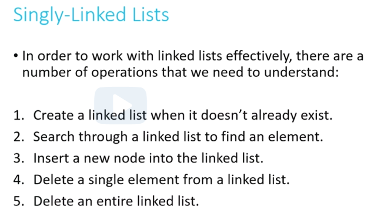

delete a single element from a linked list

not provide a way to go backwards, can only move in one single direction

```c
typedef struct sllist
{
	VALUE val;
	struct sllist* next;
}
sllnode;

sllnode* create(VALUE val);

sllnode* new = create(6);

bool find(sllnode* head, VALUE val);

sllnode* insert(sllnode* head, VALUE val);

list = insert(list, 12);

void destroy(sllnode* head);

destroy(list);
```

##### Double-Linked lists

can move forwards or backwards from the list

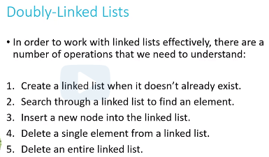

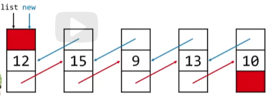

```c
typedef struct dllist
{
	VALUE val;
	struct dllist* prev;
	struct dllist* next;
}
dllnode;

dllnode* insert(dllnode* head, VALUE val);

list = insert(list, 12);

void delete(dllnode* target);

delete(x);
```

#### Trees

Following the branch to find what you want.

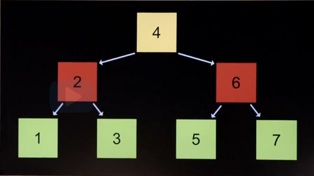

```c
typedef struct node
{
	int number;
	struct node *left;
	struct node *right;
}
node;

bool search(node *tree, int number)
{
	if (tree = NULL)
	{
		return false;
	}
	else if (number < tree->number)
	{
		return search(tree->left, number);
	}
	else if (number > tree->number)
	{
		return search(tree->right, number);
	}
	else if (number == tree->number)
	{
		return true;
	}
}
// We use lots of memory with this current search
```

#### Hash tables (arrays)

hashing - input some values and output a simpler version of their own values (known values)

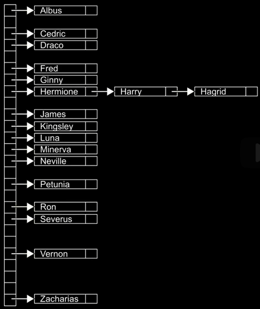

has function + array

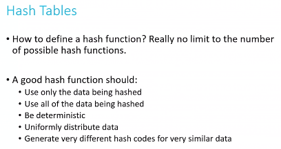

how linear probing works to solve clustering

chaining to solve collisions

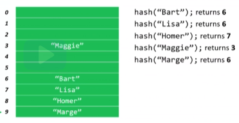

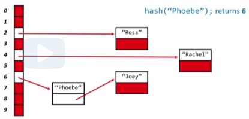

```c
typedef struct node
{
	string name;
	string number;
}
node;

int main(void)
{
	node *table[26]; // A -> Z
}
```

```c
string hastable[10];

int x = hash("John");
int y = hash("Paul");
int z = hash("Ringo");

// x is now 4
hastable[x] = "John";

// y is now 6
hastable[y] = "Paul";

// z is also now 6
// collision for y and z -> solve by Linear probing

unsigned int hash(char* str)
{
	int sum = 0;
	for (int j = 0; str[j] != '\\0'; j++)
	{
		sum += str[j];
	}
	return sum % HASH_MAX;
}
```

```c
node* hastable[10];

hash("Joey"); // return 6
hash("Ross"); // return 2
hash("Rachel"); // return 4
hash("Phoebe"); // return 6
```

#### Tries

it is a tree (horizontal)

arrays + hash tables

combine structures and pointers together

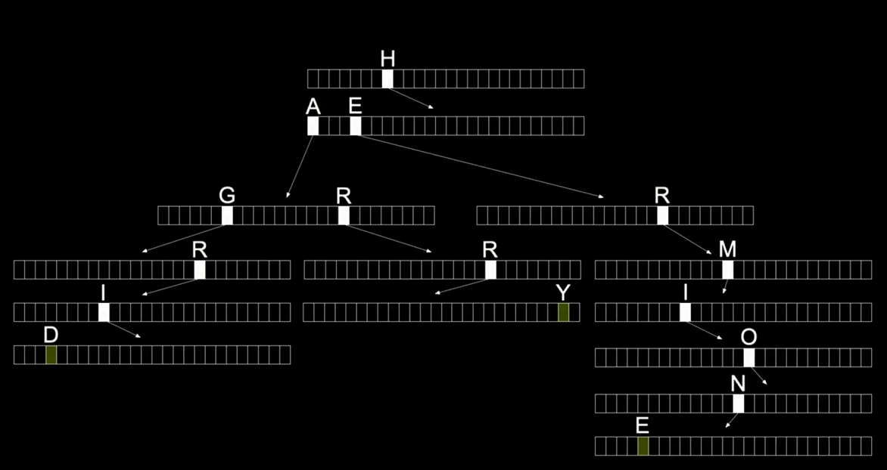

having a central **root** node to a **leaf** node. making sure they have a connection.

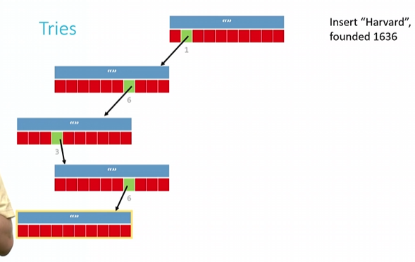

```c
typedef struct node
{
	char *number;
	struct node *children[26];
}
node;
```

```c
typedef struct _trie
{
	char university[20];
	struct _trie* paths[10]; // 10 possible places to go
}
trie;
```

#### Queues

array or double-linked lists

FIFO (first in first out)

Enqueue: add a new element to the end of the queue

Dequeue: remove from the front

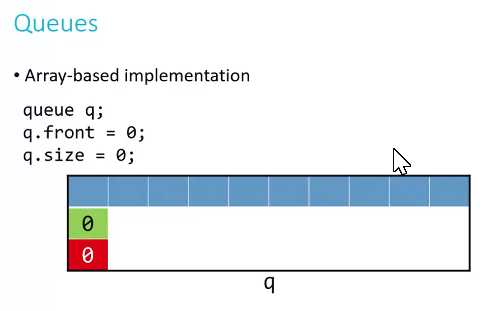

```c
typedef struct _queue
{
	VALUE array[CAPACITY];
	int front;
	int size;
}
queue;
```

#### Stacks

array or singly-linked lists

LIFO (last in first out)

Push: add a new element to the top

Pop: remove recently added element from the top

```c
typedef struct _stack
{
	VALUE array[CAPACITY];
	int top;
}
stack;
```
